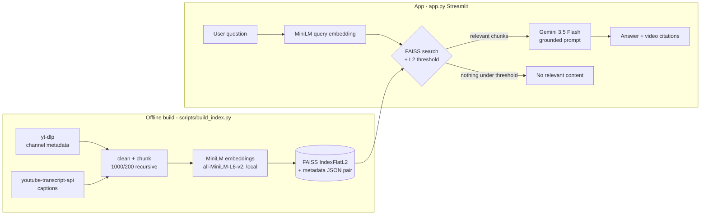

# ChannelMind — RAG over any YouTube channel

Ask questions grounded in a YouTube channel's actual videos. ChannelMind
scrapes a channel's captions, chunks and embeds them locally, retrieves
with FAISS, and answers with Gemini — citing the source videos it used.

Default corpus: [Aprilynne Alter](https://www.youtube.com/channel/UC-PaZZpjgJ61wkK9yKfpe8w)
(YouTube-growth educator). Point it at any public channel with captions
via `--channel`.

## Why

Channel back-catalogs are unsearchable in practice. Creators answer the
same questions over and over that their own videos already cover.
ChannelMind turns a channel into a queryable knowledge base with honest
"not covered in these videos" behavior instead of hallucinated answers.

## Architecture



Key design points:

- **Local embeddings** (sentence-transformers MiniLM, 384-dim) — no
  embedding API cost, works offline after the model download.
- **Matched-pair artifacts** — `data/faiss_index.index` and
  `data/faiss_metadata.json` are written together; loaders verify
  `ntotal == len(chunks)` and the embedding dimension before serving.
- **Hybrid retrieval + rerank** — BM25 (keyword) fused with dense FAISS via
  reciprocal-rank fusion, then a CPU cross-encoder reranks the fused top-50.
  Both are config flags so the pipeline can be A/B'd against the dense-only
  baseline on the same index (see the eval table below).
- **Relevance threshold** — MiniLM vectors are unit-norm, so FAISS
  squared-L2 = `2 - 2*cosine`. Final results are gated by dense distance:
  off-topic questions get "no relevant content", not forced top-k.
- **Resumable scraping** — transcript fetches are cached; YouTube
  rate-limit blocks are detected, retried with backoff, and never
  mis-recorded as "video has no captions".

## Retrieval evaluation — dense → hybrid → rerank (real runs)

The whole point of this project is to measure retrieval, find the ceiling,
and move it. The dense-only baseline was retrieval-bound, so two
production-standard first/second-stage techniques were added and A/B'd on
the **same committed index** (`data/faiss_index.index`, 1141 chunks), toggled
by config flags:

- **Hybrid** — BM25 (sparse/keyword) fused with dense FAISS via
  reciprocal-rank fusion, so exact terms (names, product names, numbers) the
  dense model ranks too low still enter the candidate pool.
- **+Rerank** — a CPU cross-encoder (`ms-marco-MiniLM-L6-v2`) reorders the
  fused top-50 to the final top-k.

Every number below is from a real run this session
(`python scripts/eval_retrieval.py [--hybrid] [--rerank]`, `PYTHONHASHSEED=0`).

### Expanded set — 55 labeled queries (`eval/queries_expanded.json`)

Authored against the actual transcripts; every target video genuinely
answers its query, and all 55 targets are in-corpus (so retrieval can
actually reach them — 0/55 unreachable). This is the set to trust.

| Config          | Recall@1 | Recall@3 | Recall@5 | MRR   |
|-----------------|----------|----------|----------|-------|
| dense-only      | 0.509    | 0.818    | 0.855    | 0.684 |
| + hybrid        | 0.509    | 0.855    | 0.909    | 0.688 |
| + hybrid + rerank | **0.673** | **0.891** | **0.964** | **0.788** |

Hybrid adds a modest Recall@3/@5 lift (it widens the candidate pool); the
**cross-encoder is the decisive lever**, moving Recall@1 0.509 → 0.673 and
MRR 0.684 → 0.788 by reordering already-retrieved candidates — exactly the
"retrieve wide, rerank precise" production pattern. This is the config the
app ships with (`config.HYBRID = True`, `config.RERANK = True`).

### Legacy set — original 20 queries (`eval/queries.json`)

Kept unchanged as the originally-published baseline. **Not comparable to the
expanded numbers above** — 9 of its 20 targets are videos that aren't in the
committed corpus at all (they can never be retrieved), which caps every
metric and makes the set noisy.

| Config          | Recall@1 | Recall@3 | Recall@5 | MRR   |
|-----------------|----------|----------|----------|-------|
| dense-only      | 0.250    | 0.450    | 0.450    | 0.365 |
| + hybrid        | 0.350    | 0.450    | 0.550    | 0.425 |
| + hybrid + rerank | 0.350  | 0.450    | 0.550    | **0.412** |

**Honest negative:** on the legacy set the cross-encoder does *not* help — it
leaves Recall@k flat and slightly lowers MRR (0.425 → 0.412) vs. hybrid
alone. That's a real result, not a bug: with 9/20 targets unreachable the
reranker only reshuffles the handful of reachable hits, and on n=11 that
reshuffle is noise. It's the clearest argument for why the eval set had to
be expanded before trusting any delta — which is what the 55-query set is
for. (The dense-only legacy row is the floor the CI regression gate defends.)

Distance-threshold separation (`config.DISTANCE_THRESHOLD = 1.10`) still
holds: on-topic top-1 dense distances run 0.467–1.073 (mean 0.743) while five
clearly off-topic control queries (boiling points, pasta recipes, tax filing,
cricket rules, Roman history) score 1.458–1.688 — a clean gap, so the app's
"no relevant content" fallback fires correctly for out-of-scope questions.

## Quickstart

```bash
python -m venv .venv && source .venv/bin/activate
pip install -r requirements-dev.txt

# 1. Build the index (defaults from config.py; any channel works)
python scripts/build_index.py                # or --channel UCxxxx --limit 10

# 2. Evaluate retrieval
python scripts/eval_retrieval.py --report-distances

# 3. Run the app
export GOOGLE_API_KEY=your-gemini-key        # https://aistudio.google.com/apikey
streamlit run app.py
```

Runtime-only install (pre-built index committed in `data/`):
`pip install -r requirements.txt`, set `GOOGLE_API_KEY`, `streamlit run app.py`.

### Deploying to Hugging Face Spaces

This README's front-matter is the Spaces config (Streamlit SDK). Push the
repo to a Space, then add `GOOGLE_API_KEY` under
**Settings → Variables and secrets**. The committed `data/` pair means the
Space needs no YouTube access at runtime.

## Tests

```bash
pytest tests/ -v
```

The suite is fully offline: YouTube calls are mocked and embeddings come
from a deterministic fake embedder, so CI never downloads torch models.

## Limitations

- Captions only by default — videos without captions are skipped unless
  you pass `--whisper` (local Whisper transcription, slow, needs ffmpeg).
- YouTube aggressively rate-limits bulk caption fetching (~20-25 rapid
  requests per IP). The build is resumable; full-channel builds may need
  more than one run. Metrics/view counts are a snapshot at build time.
- Single-channel index per build; no incremental updates (rebuild to
  refresh).
- Retrieval is a two-stage pipeline: BM25 + dense fused via RRF, then a CPU
  cross-encoder rerank (both flag-toggleable, dense-only remains the
  baseline). No learned/fine-tuned reranker or embedding — a pretrained
  cross-encoder is the right call for a corpus this size; FAISS flat/exact
  search is correct at 1141 vectors and needs no ANN tuning.
- The cross-encoder model (`ms-marco-MiniLM-L6-v2`, ~90 MB) downloads on
  first use, so a fresh Hugging Face Space has a one-time cold-start cost the
  first query pays; set `config.RERANK = False` to skip it.
- Answers are grounded in retrieved excerpts, but generation quality
  depends on Gemini; the app instructs the model to admit when excerpts
  don't cover the question.

## Repo layout

```
app.py                     Streamlit app (retrieval + Gemini generation)
config.py                  All defaults (channel, chunking, models, threshold)
core/                      youtube scraping / pipeline / retrieval modules
scripts/build_index.py     Offline corpus build (captions -> FAISS pair)
scripts/eval_retrieval.py  Recall@k / MRR on the labeled set in eval/
data/                      Committed index + metadata pair
tests/                     Offline pytest suite
```
