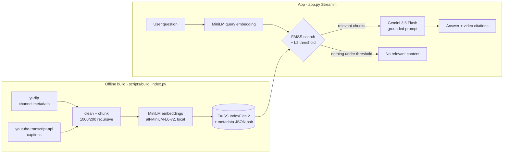

# ChannelMind — RAG over any YouTube channel

Ask questions grounded in a YouTube channel's actual videos. ChannelMind
scrapes a channel's captions, chunks and embeds them locally, retrieves
with FAISS, and answers with Gemini — citing the source videos it used.

Default corpus: [Aprilynne Alter](https://www.youtube.com/channel/UC-PaZZpjgJ61wkK9yKfpe8w)
(YouTube-growth educator). Point it at any public channel with captions
via `--channel`.

## Why

Channel back-catalogs are unsearchable in practice. Creators answer the
same questions over and over that their own videos already cover.
ChannelMind turns a channel into a queryable knowledge base with honest
"not covered in these videos" behavior instead of hallucinated answers.

## Architecture



Key design points:

- **Local embeddings** (sentence-transformers MiniLM, 384-dim) — no
  embedding API cost, works offline after the model download.
- **Matched-pair artifacts** — `data/faiss_index.index` and
  `data/faiss_metadata.json` are written together; loaders verify
  `ntotal == len(chunks)` and the embedding dimension before serving.
- **Relevance threshold** — MiniLM vectors are unit-norm, so FAISS
  squared-L2 = `2 - 2*cosine`. Results above the threshold are dropped:
  off-topic questions get "no relevant content", not forced top-k.
- **Resumable scraping** — transcript fetches are cached; YouTube
  rate-limit blocks are detected, retried with backoff, and never
  mis-recorded as "video has no captions".

## Retrieval evaluation (real run)

`python scripts/eval_retrieval.py --report-distances`, against the committed
`data/faiss_index.index` / `data/faiss_metadata.json` (1141 chunks), on the
20-question labeled set in `eval/queries.json`:

| Metric    | Value |
|-----------|-------|
| Recall@1  | 0.250 |
| Recall@3  | 0.450 |
| Recall@5  | 0.450 |
| MRR       | 0.365 |

This is the honest baseline for pure dense MiniLM retrieval with no
keyword/BM25 hybrid and no reranker (see Limitations). 9 of 20 queries
never rank the expected video in the top 50 at all — mostly questions
phrased around a creator's name or general framing ("how did MrBeast
figure out the algorithm") rather than the terms actually used in the
transcript. Recall@3 == Recall@5 here because no additional expected
videos are recovered between rank 3 and rank 5 on this label set.

Distance-threshold separation (`config.DISTANCE_THRESHOLD = 1.10`) holds on
this run: on-topic top-1 distances range 0.467-1.073 (mean 0.743), while
five clearly off-topic control queries (boiling points, pasta recipes,
tax filing, cricket rules, Roman history) score 1.458-1.688 — a clean gap,
so the app's "no relevant content" fallback fires correctly for
out-of-scope questions even though in-scope recall has real headroom.

## Quickstart

```bash
python -m venv .venv && source .venv/bin/activate
pip install -r requirements-dev.txt

# 1. Build the index (defaults from config.py; any channel works)
python scripts/build_index.py                # or --channel UCxxxx --limit 10

# 2. Evaluate retrieval
python scripts/eval_retrieval.py --report-distances

# 3. Run the app
export GOOGLE_API_KEY=your-gemini-key        # https://aistudio.google.com/apikey
streamlit run app.py
```

Runtime-only install (pre-built index committed in `data/`):
`pip install -r requirements.txt`, set `GOOGLE_API_KEY`, `streamlit run app.py`.

### Deploying to Hugging Face Spaces

This README's front-matter is the Spaces config (Streamlit SDK). Push the
repo to a Space, then add `GOOGLE_API_KEY` under
**Settings → Variables and secrets**. The committed `data/` pair means the
Space needs no YouTube access at runtime.

## Tests

```bash
pytest tests/ -v
```

The suite is fully offline: YouTube calls are mocked and embeddings come
from a deterministic fake embedder, so CI never downloads torch models.

## Limitations

- Captions only by default — videos without captions are skipped unless
  you pass `--whisper` (local Whisper transcription, slow, needs ffmpeg).
- YouTube aggressively rate-limits bulk caption fetching (~20-25 rapid
  requests per IP). The build is resumable; full-channel builds may need
  more than one run. Metrics/view counts are a snapshot at build time.
- Single-channel index per build; no incremental updates (rebuild to
  refresh).
- Retrieval is pure dense similarity — no keyword/BM25 hybrid, no
  reranker. The eval below is the honest baseline.
- Answers are grounded in retrieved excerpts, but generation quality
  depends on Gemini; the app instructs the model to admit when excerpts
  don't cover the question.

## Repo layout

```
app.py                     Streamlit app (retrieval + Gemini generation)
config.py                  All defaults (channel, chunking, models, threshold)
core/                      youtube scraping / pipeline / retrieval modules
scripts/build_index.py     Offline corpus build (captions -> FAISS pair)
scripts/eval_retrieval.py  Recall@k / MRR on the labeled set in eval/
data/                      Committed index + metadata pair
tests/                     Offline pytest suite
```
