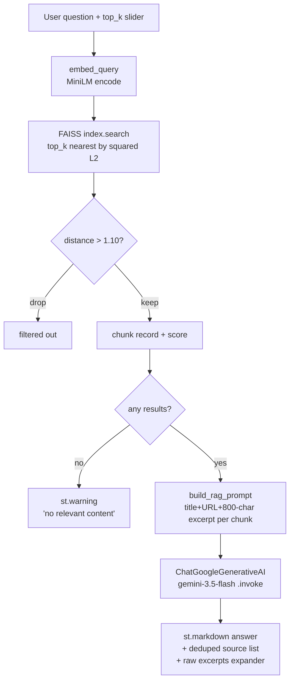

# Architecture — ChannelMind

RAG chatbot over a single YouTube channel's transcripts: scripted offline
corpus build (scrape → clean → chunk → embed → FAISS) plus a Streamlit app
that retrieves from the committed index and generates with Gemini.

## Folder map

```
app.py                     Streamlit UI + query -> retrieve -> prompt -> generate wiring
config.py                  Single source of defaults: channel id, chunking, embed model,
                            Gemini model, index paths, retrieval threshold/top_k
core/
  youtube.py                yt-dlp channel listing, transcript fetch (+ optional Whisper
                             fallback), rate-limit detection (TranscriptFetchBlocked)
  pipeline.py                clean_text / chunk_transcript / chunk_corpus, embedding
                             helpers, FAISS index build, matched-pair writer
  retrieval.py                index+metadata pair loader (with consistency checks),
                             thresholded FAISS search, query embedding helper
scripts/
  build_index.py            CLI: orchestrates youtube.py + pipeline.py end-to-end,
                             writes data/faiss_index.index + data/faiss_metadata.json
  eval_retrieval.py          Recall@k / MRR harness against eval/queries.json
eval/queries.json           20 hand-labeled (question -> expected_video_ids) pairs
data/
  faiss_index.index         Committed FAISS IndexFlatL2, 1141 vectors, dim 384
  faiss_metadata.json        Chunk records + build_info, paired 1:1 with the index
  transcripts_cache.json     video_id -> raw transcript cache (resumability)
notebooks/youtube_scraper.ipynb  Original Colab notebook this pipeline replaced (kept,
                                  unused — see CODE-AUDIT.md)
tests/                      29 offline pytest tests (fake embedder, mocked YouTube calls)
docs/PROJECT-NOTES.md        Running changelog / operational notes (hand-maintained)
.github/workflows/ci.yml     Push/PR CI: pytest only, no heavy ML deps installed
```

## Corpus build pipeline (offline, `scripts/build_index.py`)

```mermaid
flowchart TD
    A[fetch_channel_videos\nyt-dlp uploads playlist] --> B{per video}
    B --> C[fetch_transcript\nyoutube-transcript-api]
    C -->|RequestBlocked| C2[TranscriptFetchBlocked\nretry w/ backoff, NOT cached]
    C2 -.retry.-> C
    C -->|no captions, --whisper| C3[transcribe_with_whisper\nyt-dlp audio + Whisper]
    C -->|ok / none| D[transcripts_cache.json\nvideo_id -> text]
    D --> E[chunk_corpus]
    E --> E1[clean_text\nstrip timestamps/URLs, collapse whitespace]
    E1 --> E2[RecursiveCharacterTextSplitter\nchunk_size=1000, overlap=200]
    E2 --> F[chunk records\nvideo metadata + chunk_index + chunk_text]
    F --> G[embed_texts\nSentenceTransformer all-MiniLM-L6-v2, batch=64]
    G --> H[build_faiss_index\nIndexFlatL2, 384-dim]
    H --> I[write_index_pair\nrefuses if ntotal != len(chunks)]
    I --> J[(data/faiss_index.index)]
    I --> K[(data/faiss_metadata.json\nchunks + build_info)]
```

Videos with no usable transcript (and no `--whisper`) are silently skipped
at the `chunk_corpus` stage — they never enter the index. The transcript
cache is keyed by `video_id`; a blocked fetch is deliberately **not**
written to the cache, so a rerun retries only the videos that actually
failed rather than every video.

## Query flow (`app.py`, Streamlit)



Resource loading (`load_resources`, `@st.cache_resource`) reads the FAISS
index + metadata pair once per process, loads the MiniLM `SentenceTransformer`,
and constructs the Gemini `ChatGoogleGenerativeAI` client. Missing or
inconsistent index artifacts raise `FileNotFoundError` /
`IndexMetadataMismatch` from `core.retrieval.load_index_pair`, which the app
catches and turns into an `st.error` + `st.stop()` (no traceback shown to
the user; the message tells them to run `scripts/build_index.py`).

The retrieval `score` field is squared L2 distance (lower = more similar),
displayed directly in the "Sources" list rather than converted to a
similarity/percentage.

## Chunking / embedding config

| Parameter | Value | Where set | Notes |
|---|---|---|---|
| Chunk size | 1000 chars | `config.CHUNK_SIZE` | `RecursiveCharacterTextSplitter`, separators `["\n\n","\n",".","!","?",",", " ", ""]` |
| Chunk overlap | 200 chars | `config.CHUNK_OVERLAP` | 20% of chunk size |
| Embedding model | `all-MiniLM-L6-v2` | `config.EMBED_MODEL` | sentence-transformers, local, 384-dim, unit-normalized output |
| Embed batch size | 64 | `config.EMBED_BATCH_SIZE` | used both at build time and (implicitly, batch=1) at query time |
| FAISS index type | `IndexFlatL2` | `core/pipeline.py::build_faiss_index` | exact search, squared L2 distance; no ANN/quantization |
| Distance threshold | 1.10 | `config.DISTANCE_THRESHOLD` | squared-L2 cutoff; since vectors are unit-norm, `d² = 2 − 2·cosine`, so 1.10 ≈ cosine 0.45 |
| Retrieval top_k | 4 (default) | `config.TOP_K`, adjustable 2–8 via UI slider | passed straight to `index.search` |
| Generation model | `gemini-3.5-flash` | `config.GEMINI_MODEL` | via `langchain-google-genai`; superseded `gemini-1.5-pro-latest` / `gemini-2.5-flash` (see PROJECT-NOTES) |

Chunk records carry the full `VIDEO_FIELDS` tuple (`video_id`, `title`,
`publish_date`, `view_count`, `duration`, `video_url`, `channel_name`) plus
`chunk_index` and `chunk_text` — i.e. video metadata is denormalized onto
every chunk rather than joined at query time.

## Eval harness (`scripts/eval_retrieval.py`)

- Input: `eval/queries.json`, 20 hand-labeled `{question, expected_video_ids}`
  pairs built from real video titles on the committed corpus.
- Method: embed each question, search the full index (`top_k=50`,
  `max_distance=None`), collapse the ranked chunk hits to a **video-level**
  ranking (first occurrence per `video_id`, since results already arrive
  distance-ascending), then compute the best (lowest) rank of any expected
  video id for that query.
- Metrics: Recall@1 / Recall@3 / Recall@5 (fraction of queries whose best
  expected-video rank is ≤ k) and MRR (mean reciprocal rank over queries
  that hit at all; misses contribute 0 via the `if r is not None` filter in
  the sum, not via a penalty term).
- `--report-distances`: additionally reports top-1 distance distribution
  for the on-topic set vs. 5 hardcoded off-topic control queries (baked
  into the script, not eval/queries.json), used to sanity-check
  `DISTANCE_THRESHOLD` separates in-scope from out-of-scope questions.
- Real numbers on the committed 1141-chunk index (from README /
  PROJECT-NOTES): Recall@1 0.250, Recall@3 0.450, Recall@5 0.450, MRR
  0.365; on-topic top-1 distances 0.467–1.073, off-topic 1.458–1.688.
- This harness measures retrieval only — it does not score generation
  quality, and it is not run in CI (CI runs only `tests/`).

## Config surface (`config.py`)

Everything is a plain module-level constant, resolved once at import time,
with paths built from `REPO_ROOT = Path(__file__).resolve().parent` so the
app/scripts work regardless of cwd. `scripts/build_index.py` mirrors every
tunable as an `argparse` flag with the `config.py` value as its default
(`--channel`, `--chunk-size`, `--chunk-overlap`, `--embed-model`,
`--batch-size`, plus build-only knobs: `--limit`, `--whisper`,
`--sleep-min/max`, `--no-cache`, `--max-retries`, `--backoff`).
`scripts/eval_retrieval.py` overrides only `--eval-set` / `--index` /
`--metadata`; it reads `config.EMBED_MODEL` directly rather than accepting
an override. `app.py` reads `config` directly with no CLI surface (Streamlit
secrets only override `GOOGLE_API_KEY`).

## Test layout (29 tests, `tests/`)

| File | Focus |
|---|---|
| `conftest.py` | `FakeEmbedder` (hash-seeded deterministic unit vectors, 8-dim, no torch) + shared 3-video/transcript fixtures |
| `test_youtube.py` | `uploads_playlist_url`, `normalize_entry`, `parse_playlist_info` against mocked yt-dlp dumps; `fetch_transcript` behavior on disabled/blocked/success via `monkeypatch` on `YouTubeTranscriptApi.fetch` |
| `test_pipeline.py` | `clean_text` (timestamps/URLs/whitespace/non-string), `chunk_transcript` (size/overlap/short-text), `chunk_corpus` (skips missing transcripts, carries `VIDEO_FIELDS`, sequential `chunk_index`) |
| `test_build_and_retrieval.py` | End-to-end build on fixture data using `FakeEmbedder`: matched-pair write/load, mismatch detection (`ValueError` on write, `IndexMetadataMismatch` on tampered count/dim), thresholded search behavior (exact match, filtering, off-topic empty, unthresholded top-k, ascending scores) |

The whole suite is offline: no real network calls, no real embedding model
download. CI (`.github/workflows/ci.yml`) installs only the light
dependencies actually exercised (`faiss-cpu`, `numpy`,
`langchain-text-splitters`, `youtube-transcript-api`, `pytest`) — no
`torch`/`sentence-transformers`/`streamlit`/`langchain-google-genai` — and
pins `PYTHONHASHSEED=0` so `FakeEmbedder`'s `hash()`-seeded vectors are
reproducible across runs.
